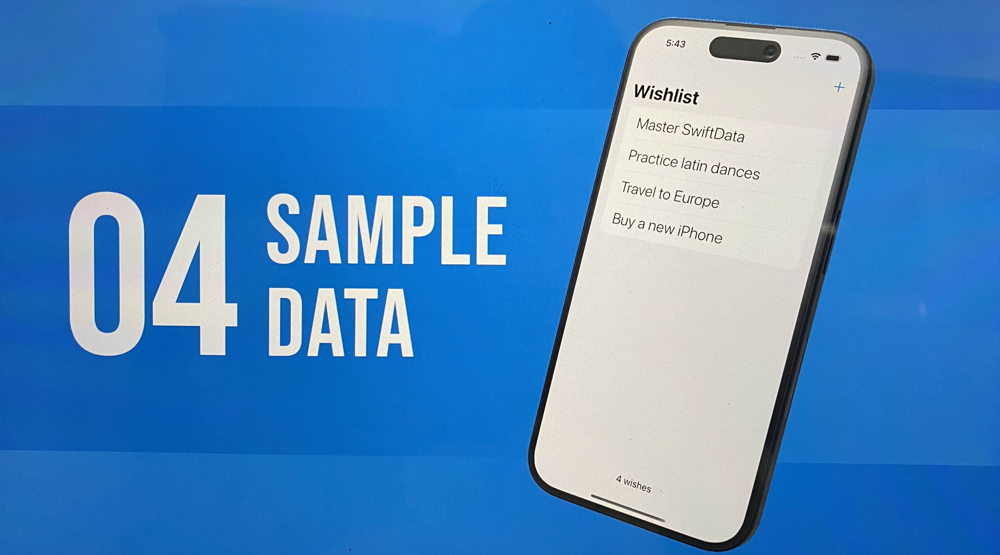
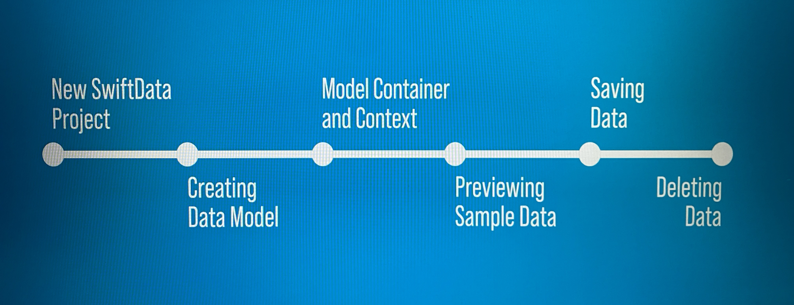

# 🎁 Wishlist App (SwiftUI + SwiftData)



[](https://swift.org)
[](https://developer.apple.com/xcode/)
[](https://developer.apple.com/ios/)
[](https://developer.apple.com/xcode/swiftui/)
[](https://developer.apple.com/documentation/swiftdata)

---

## 📌 Description
Ce projet est une petite application de **Wishlist**, conçue pour explorer la simplicité de **SwiftData** en combinaison avec **SwiftUI**.  
L’objectif est d’apprendre à **créer, sauvegarder, prévisualiser et supprimer des données persistantes** de manière moderne, sans la complexité de Core Data.

---

## 📚 Ce que j’ai appris

En développant cette app, j’ai pu découvrir les concepts fondamentaux de **SwiftData** :

1. **New SwiftData Project** – Initialiser un projet configuré avec SwiftData.  
2. **Creating Data Model** – Définir un modèle simple avec la macro `@Model`.  
3. **Model Container & Context** – Gérer la persistance grâce au `ModelContainer` et au `ModelContext`.  
4. **Previewing Sample Data** – Générer des données factices pour tester l’UI dans le canvas de Xcode.  
5. **Saving Data** – Ajouter de nouveaux éléments dans la base de données.  
6. **Deleting Data** – Supprimer des éléments avec simplicité.



---

## 🚀 Installation et Lancement du projet

### 1️⃣ Cloner le projet
```bash
git clone https://github.com/josue-lubaki/Wishlist.git
cd Wishlist
```

## License
[MIT License](https://github.com/josue-lubaki/whishlist/blob/main/LICENSE)

```
MIT License

Copyright (c) 2025 Josue Lubaki

Permission is hereby granted, free of charge, to any person obtaining a copy
of this software and associated documentation files (the "Software"), to deal
in the Software without restriction, including without limitation the rights
to use, copy, modify, merge, publish, distribute, sublicense, and/or sell
copies of the Software, and to permit persons to whom the Software is
furnished to do so, subject to the following conditions:

The above copyright notice and this permission notice shall be included in all
copies or substantial portions of the Software.

THE SOFTWARE IS PROVIDED "AS IS", WITHOUT WARRANTY OF ANY KIND, EXPRESS OR
IMPLIED, INCLUDING BUT NOT LIMITED TO THE WARRANTIES OF MERCHANTABILITY,
FITNESS FOR A PARTICULAR PURPOSE AND NONINFRINGEMENT. IN NO EVENT SHALL THE
AUTHORS OR COPYRIGHT HOLDERS BE LIABLE FOR ANY CLAIM, DAMAGES OR OTHER
LIABILITY, WHETHER IN AN ACTION OF CONTRACT, TORT OR OTHERWISE, ARISING FROM,
OUT OF OR IN CONNECTION WITH THE SOFTWARE OR THE USE OR OTHER DEALINGS IN THE
SOFTWARE.
```
